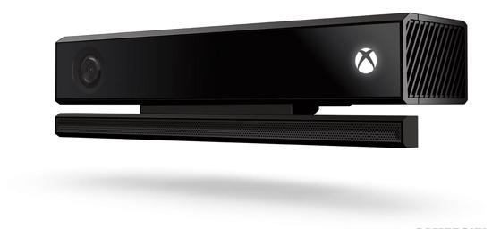
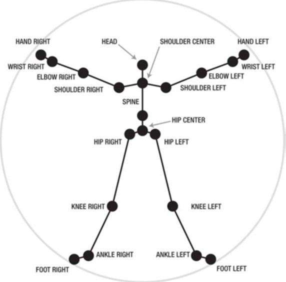
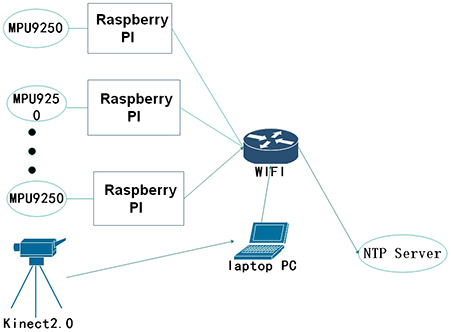
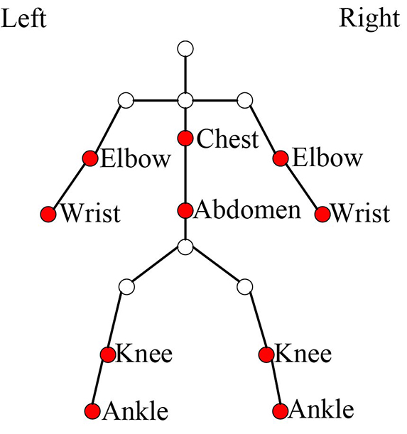

  <h2 align="center">CZU-MHAD: A multimodal dataset for human action recognition utilizing a depth camera and 10 wearable inertial sensors</h2>

&emsp;&emsp;In order to facilitate the research of multi-modal sensor fusion for human action recognition, this paper provides a multi-modal human action dataset using Kinect depth camera and multile wearable sensors, which is called Changzhou University multi-modal human action dataset (CZU-MHAD). Our dataset contains more wearable sensors, which aims to obtain the position data of human skeleton joints, as well as 3-axis acceleration and 3-axis angular velocity data of corresponding joints. Our dataset provides time synchronous depth video, skeleton joint position, 3-axis acceleration and 3-axis angular velocity data to describe a complete human action.

## 1. Sensors

&emsp;&emsp;The CZU-MHAD uses 1 Microsoft Kinect V2 and 10 wearable sensors MPU9250. These two kinds of sensors are widely used, which have the characteristics of low power consumption, low cost and simple operation. In addition, it does not require too much computing power to process the data collected by the two kind sensors in real time.

### 1.1 Kinect v2

 

&emsp;&emsp;The above picture is the Microsoft Kinect V2, which can collect both color and depth images at a sampling frequency of 30 frames per second. Kinect SDK is a software package provided by Microsoft, which can be used to track 25 skeleton joint points and their 3D spatial positions. You can download the Kinect SDK in `https://www.microsoft.com/en-us/download/details.aspx?id=44561`.

 

&emsp;&emsp;The above image shows 25 skeleton joint points of the human body that Kinect V2 can track. 

### 1.2 MPU9250

&emsp;&emsp;The MPU9250 can capture 3-axis acceleration, 3-axis angular velocity and 3-axis magnetic intensity. 
- The measurement range of MPU9250: 
  - the measurement range of accelerometer is ±16g;
  - the measurement range of angular velocity of the gyroscope is ±2000 degrees/second. 

&emsp;&emsp;CZU-MHAD uses Raspberry PI to interact with MPU9250 through the integrated circuit bus (IIC) interface, realizing the functions of reading, saving and uploading MPU9250 sensor data to the server.The connection between Raspberry PI and MPU9250 is shown in picture. 

 

 &emsp;&emsp;You can visit `https://projects.raspberrypi.org/en/projects/raspberry-pi-setting-up` to learn more about Raspberry PI.

## 2. Data Acquisition System Architecture

&emsp;&emsp;This section introduces the data acquisition system of CZU-MHAD dataset. CZU-MHAD uses Kinect V2 sensor to collect depth image and joint position data, and uses MPU9250 sensor to collect 3-axis acceleration data and 3-axis angular velocity data. In order to collect the 3-axis acceleration data and the 3-axis angular velocity data of the whole body, a motion data acquisition system including 10 MPU9250 sensors is built-in this paper. The sampling system architecture is shown in following picture.

 

&emsp;&emsp;The MPU9250 sensor is controlled by Raspberry PI, Kinect V2 is controlled by a notebook computer, and time synchronization with a NTP server is carried out every time data is collected. After considering the sampling scheme of MHAD and UTD-MHAD, the position of wearable sensors is determined as shown in the following picture.

 

&emsp;&emsp;The points marked in red in the figure are the positions of inertial sensors, the left in the figure is the left side of the human body, and the right in the figure is the right side of the human body.

## 3. Information for "CZU-MHAD" dataset.

&emsp;&emsp;The CZU-MHAD dataset contains 22 actions performed by 5 subjects (5 males). Each subject repeated each action >8 times. The CZU-MHAD dataset contains a total of >880 samples. The 22 actions performed are listed in Table. It can be seen that CZU-MHAD includes common gestures (such as Draw fork, Draw circle),daily activities (such as Sur Place, Clap, Bend down), and training actions (such as Left body turning movement, Left lateral movement).

**Describe different actions in English:**

| ID  | Action name            | ID   | Action name                 |  ID | Action name          |  ID | Action name |
| --- | ---                    | ---  |        ---                  | --- | ---                  | --- | --- |
| 1   | Right high wave        |  7   | Draw fork with right hand   |  13 | Right foot kick side |  19 | Left body turning movement |
| 2   | Left high wave         |  8   | Draw fork with left  hand         |  14 | Left foot kick side  |  20 | Right body turning movement |
| 3   | Right horizontal wave  |  9   | Draw circle with right hand |  15 | Clap                 |  21 | Left lateral movement |
| 4   | Left horizontal wave   |  10  | Draw circle with left hand  |  16 | Bend down            |  22 | Right lateral movement | 
| 5   | Hammer with right hand |  11  | Right foot kick foward      |  17 | Wave up and down     |     |  |
| 6   | Grasp with right hand  |  12  | Left foot kick foward       |  18 | Sur Place            |     |  |

**Describe different actions in Chinese:**:

| ID  | Action name            | ID   | Action name                 |  ID | Action name          |  ID | Action name |
| --- | ---                    | ---  |        ---                  | --- | ---                  | --- | --- |
| 1   | 右高挥手        |  7   | 右手画×   |  13 |  右脚侧踢 |  19  |   左体转 |
| 2   | 左高挥手         |  8   | 左手画×         |  14 |左脚侧踢  |  20 |    右体转 |
| 3   | 右水平挥手  |  9   | 右手画○ |  15 | 拍手                          |             21 |   左体侧 |
| 4   | 左水平挥手   |  10  | 左手画○  |  16  |  弯腰          |  22 |右体侧 | 
| 5   | 锤(右手) |  11  | 右脚前踢      |  17 | 上下挥手     |     |  |
| 6   | 抓(右手)  |  12  | 左脚前踢      |  18 | 原地踏步            |   | |

## 4.  How to download the dataset

&emsp;&emsp; We offer one way to download our CZU-MHAD dataset:
 
1. BaiduDisk(百度网盘)

    (Link) 链接：https://pan.baidu.com/s/1SBy0D2f1ZoX_mDyd3YEp2Q     
    (Code) 提取码：qsq1 

 

&emsp;&emsp;In the `CZU-MHAD`, you will see three subfolders:
- `depth_mat`

    &emsp;&emsp; The `depth_mat` contains the depth images captured by Kinect V2. In this folder, each file represents an action sample. Each file is named by the subject's name, the category label of the action and the time of each action of each subject.  Take `cyy_a1_t1.mat` as an example, `cyy` is the subject's name, `a1` is the name of the action, `t1` stands the first time to perform this action. How to read data is shown in our sample code.
    
- `sensors_mat`

    &emsp;&emsp; The `sensors_mat` contains the data of 3-axis acceleration and 3-axis angular velocity captured by MPU9250. In this folder, each file represents an action sample. Each file is named by the subject's name, the category label of the action and the time of each action of each subject.  Take `cyy_a1_t1.mat` as an example, `cyy` is the subject's name, `a1` is the name of the action, `t1` stands the first time to perform this action. How to read data is shown in our sample code.

- `skeleton_mat` 

    &emsp;&emsp; The `skeleton_mat` contains the position data of skeleton joint points captured by Kinect V2. In this folder, each file represents an action sample. Each file is named by the subject's name, the category label of the action and the time of each action of each subject.  Take `cyy_a1_t1.mat` as an example, `cyy` is the subject's name, `a1` is the name of the action, `t1` stands the first time to perform this action. How to read data is shown in our sample code.

## 5. Sample codes
1. BaiduDisk(百度网盘)

    (Link) 链接：https://pan.baidu.com/s/1bWq7ypygjTffkor1GAExMQ 

    (Code) 提取码：limf

 

## 6. Citation

To use our dataset, please refer to the following paper:

* Mo Yujian, Hou Zhenjie, Chang Xingzhi, Liang Jiuzhen, Chen Chen, Huan Juan. Structural feature representation and fusion of behavior recognition oriented human spatial cooperative motion[J]. Journal of Beijing University of Aeronautics and Astronautics,2019,(12):2495-2505.

## 7. Mailing List
 
&emsp;&emsp;If you are interested to recieve news, updates, and future events about this dataset, please email me. 
+ Email: yujmo94@gmail.com | linus@unix.cn.com | 1103137684@qq.com
+ QQ: 1103137684
+ Wechat: m1103137

## #. Thanks(致谢)
1. Cui Yaoyao(崔瑶瑶) 
2. Chao Xin(巢新)
3. Qin Yinhua(秦银华)
4. Zhang Yuheng(张宇恒)
5. Mo Yujian(莫宇剑)

#. Gao Liang(高亮)

#. Shi Yuhang(石宇航)

&emsp;&emsp;The subjects marked with '#' also participated in our data collection process. However, due to the unstable power supply and abnormal heat dissipation of Raspberry PI, their behavior data is abnormal. Therefore, we do not provide their data. 
